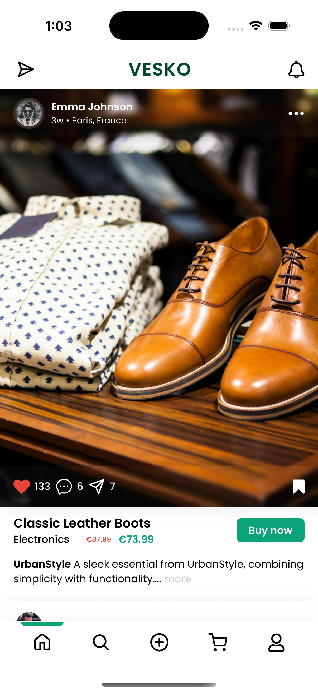
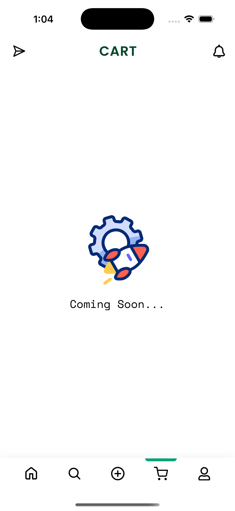
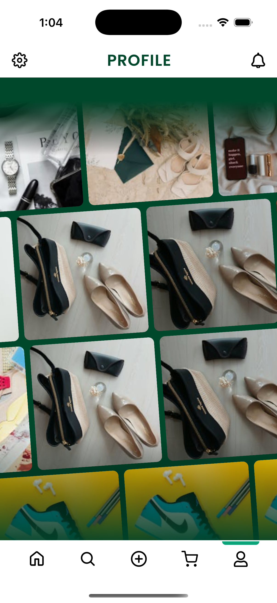

# 👟  VESKO – Socialized Shopping Marketplace

A modern **Expo + React Native (TypeScript)** mobile app that showcases a fashion feed with **shoes, clothing, and accessories**.  
Built with clean scalable architecture, reusable components, and mock image data for prototyping stylish UI.

---

## 📸 Demo Video

[▶️ Watch Video](https://drive.google.com/file/d/1wEm7Ni3b8vQI2EuVx-krw56kMLnIvdVy/view?usp=sharing)

---

## 📸 Screenshots

### Home


### Search


### Cart


### Profile


### User-Info


---

## ⚙️ Tech Stack

- **Expo** (React Native framework)  
- **TypeScript**  
- **Zustand** (local + persisted state)  
- **FlashList** (high-performance list rendering)  
- **React Native Reanimated** (animations)  
- **React Native Paper / Vector Icons** (UI components & icons)  
- **Expo Router** (file-based navigation)  

---

## ✨ Features

### 🔑 Authentication Flow
- Splash screen with Expo Router layouts (`(auth)/index`)  
- Login screen with Expo Router layouts -In-progress (`(auth)/login`)  
- Protected route handling  

### 🗂️ Tabbed Navigation
- `(tabs)/home` → Fashion feed using mock JSON data  
- `(tabs)/cart` → Shopping cart  
- `(tabs)/post` → Upload / create posts  
- `(tabs)/profile` → User profile screen  
- `(tabs)/search` → Search products  
- `+not-found.tsx` → Fallback 404 screen  

### 🎨 Reusable Components
- `FilterChips` → Category filter UI  
- `Header` → Custom app headers  
- `Input` → Styled text fields  
- `HapticTab` → Tab interactions with feedback  
- `ThemeProvider` → Dark/Light theme  

### 🧩 Feature Modules
- `features/auth` → Auth screens + logic  
- `features/tabs` → Tab UI modules  
- `features/hooks` → Custom React hooks  
- `features/stores` → Zustand stores (auth, cart, theme)  
- `features/styles` → Global stylesheets  
- `features/theme` → Theming system  
- `features/utils` → Helper functions  

### 🖼️ Mock Data
- `assets/jsons/mock.json` contains **22 curated fashion images** (sneakers, heels, outfits, accessories)  
- Royalty-free images sourced from **Pexels**  

---

## 📂 Folder Structure

```bash
src/
│── app/
│   ├── (auth)/login/...
│   ├── (tabs)/cart | home | post | profile | search
│   ├── _layout.tsx
│   ├── +not-found.tsx
│
│── assets/
│   ├── fonts/
│   ├── icons/
│   ├── images/
│   ├── jsons/aiMock.json
│
│── components/
│   ├── filterChips/
│   ├── header/
│   ├── input/
│   ├── hapticTab/
│   └── themeProvider/
│
│── features/
│   ├── auth/
│   ├── tabs/
│   ├── hooks/
│   ├── stores/
│   ├── styles/
│   ├── theme/
│   ├── types/
│   └── utils/
│
├── app.json
├── package.json
├── tsconfig.json
└── README.md
```

---

## 🛠️ Setup

### 🔐 Prerequisites
1. Node.js 18+  
2. Expo CLI  

### 📦 Installation

```bash
git clone https://github.com/Rishu2505/app_vesko.git
cd app_vesko
npm install
```

### ▶️ Running the App

```bash
npx expo start
```

Scan the QR code with **Expo Go** or run in a simulator.

---

## 📈 Possible Improvements

- API-powered product catalog  
- AI-powered search & recommendations  
- Offline caching  
- Backend integration for cart & user profile  
- Video-based posts

---

## 👤 Author

**Mukesh Kumar**  
Senior React Native Engineer  

🔗 [LinkedIn](https://www.linkedin.com/in/mukesh-kumar-a07453199) | 🌐 [Portfolio](https://portfolio-lake-three-21.vercel.app/) | 💻 [GitHub](https://github.com/Rishu2505)

---

## 📜 License

This project is for **demo & assessment purposes only**.
